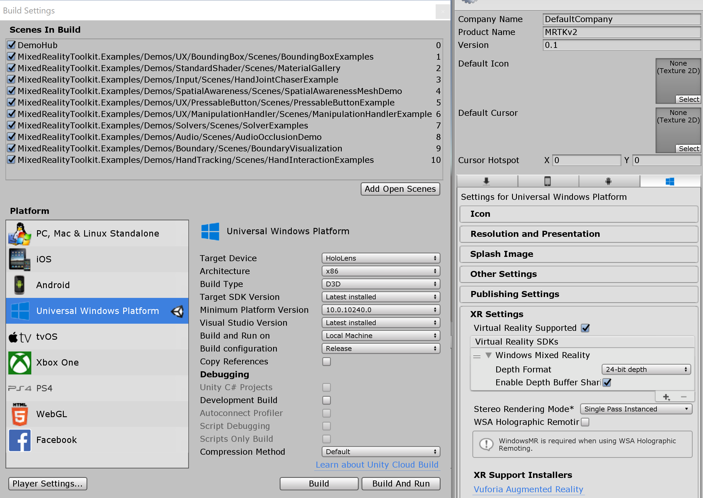

# MRTK2_Demo
Demo setup to test all MRTK v2.0.0 example scenes. 
You can find the Mixed Realty Toolkit v2.0.0 here: https://github.com/microsoft/MixedRealityToolkit-Unity/releases/tag/v2.0.0

Tested with:  
  Unity version 2018.4.2f1;  
  Visual Studio 2019 version 16.2.3;  
  Microsoft HoloLens  
 
DemoHub scene button illustration: 

 

Build Settings: 

  
 
